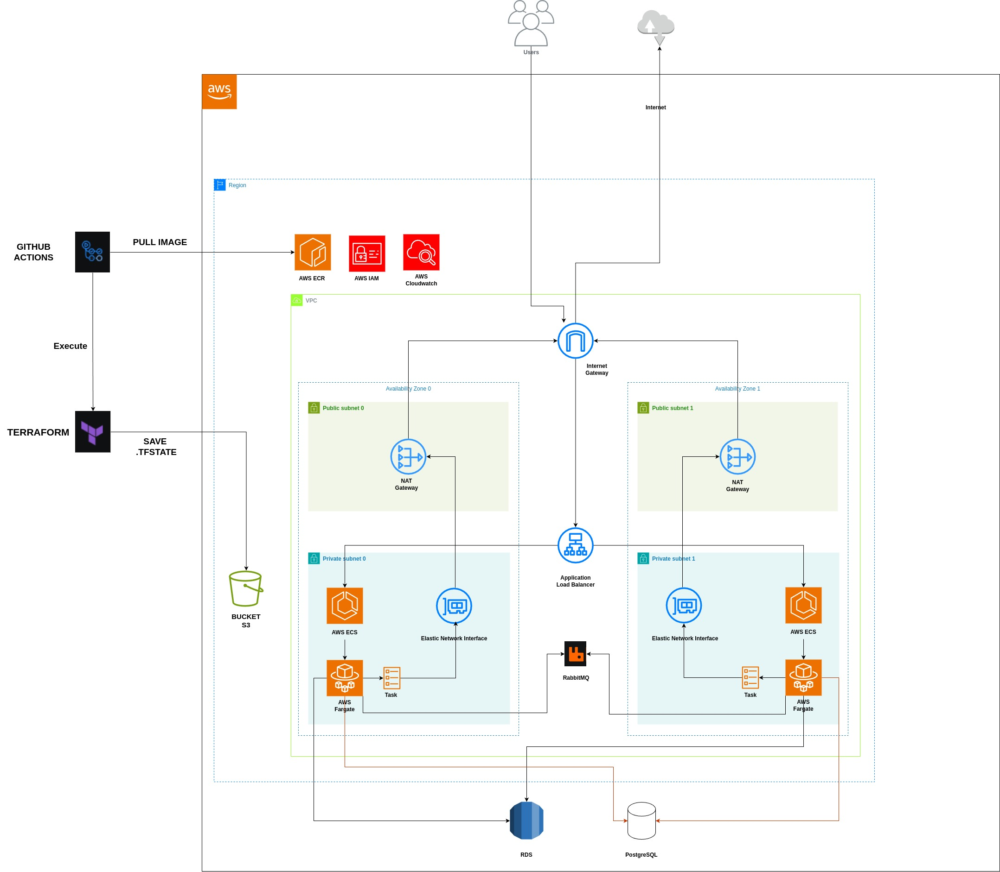

##Explicação sobre a infraestrutura:

A infraestrutura foi separada em modulos para a execução do terraform:

- AWS API Gateway
- AWS Cognito
- AWS Lambda
- AWS ECR
- AWS ECS FARGATE
- AWS Load Balancer
- AWS Bucket S3
- Grupo de segurança (AWS)
- NAT Gateway (AWS)
- VPC (AWS)
- Cloudwatch
- PostgreSQL
- RDS (MySQL)

O Github Actions faz a execução do código terraform para disponibilizar a infraestrutura e na sequencia em cada um dos repositorios de serviço faz o push das imagens para serem inseridas no ECR.
Neste repositório em específico ele só especifica as coisas da infras.
O documento em que o terraform grava seu estado chamado de .tfstate será guardado em um Bucket S3 para que quando mais de um desenvolvedor trabalhar na infra, ambos possam está atualizados com o estado real da infraestrutura aplicada.
São aplicados pelo terraform as configurações de infra desde recursos a serem utilizado até as configurações necessárias para suas interações.

- Api Gateway - Controle de rotas
- ECR - Armazenamento de imagens
- FARGATE - Provisiona as instancias
- Load Balancer - Balanceador de Carga
- Grupo de Segurança - Restrição de permissionamento de entrada e saída
- VPC - Separação de redes públicas e privadas
- Cloudwatch - Visualização de Log's
- Document DB - Utilizado para um banco NoSql, neste caso um Mongo DB.
- RDS - Banco de dado MySQL